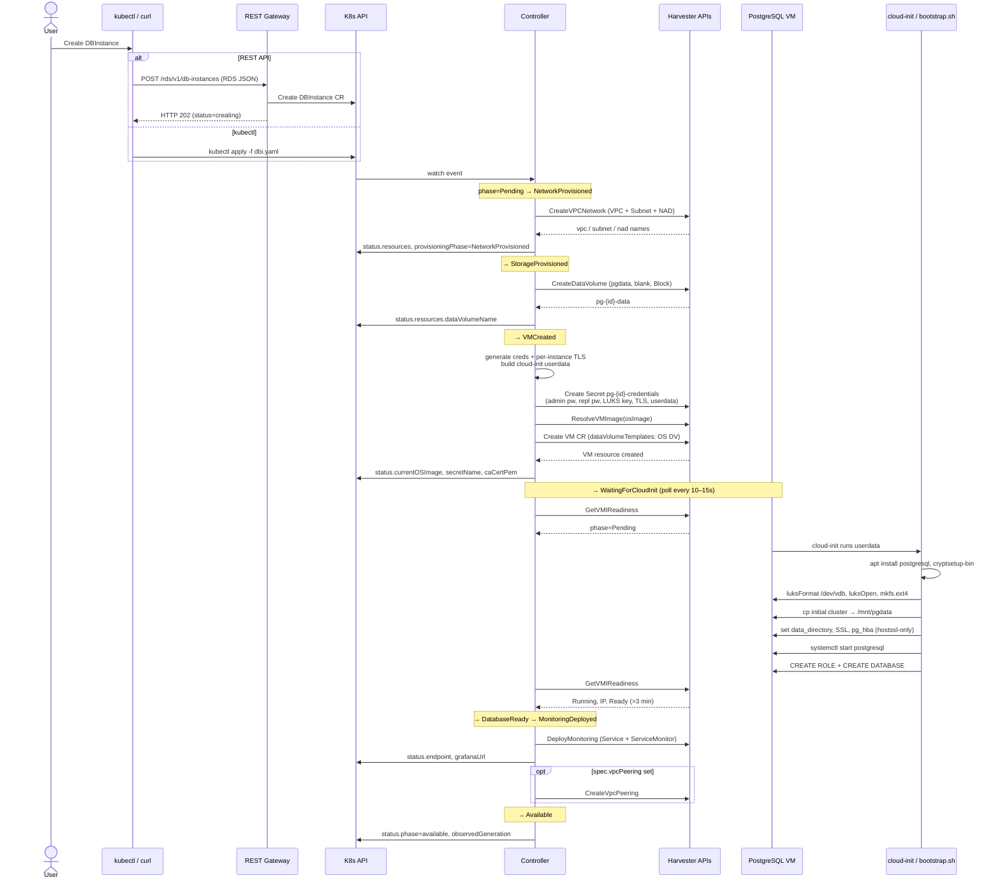
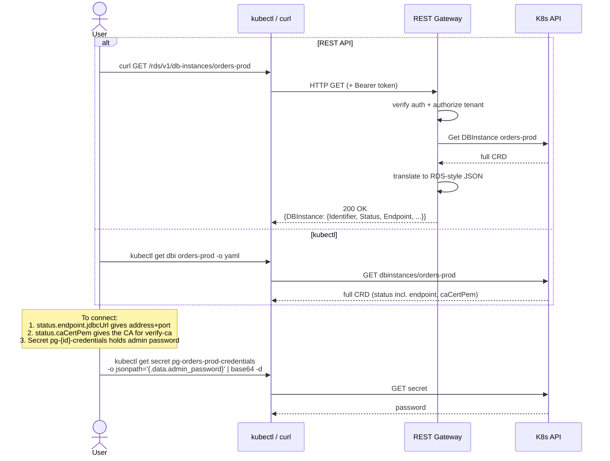
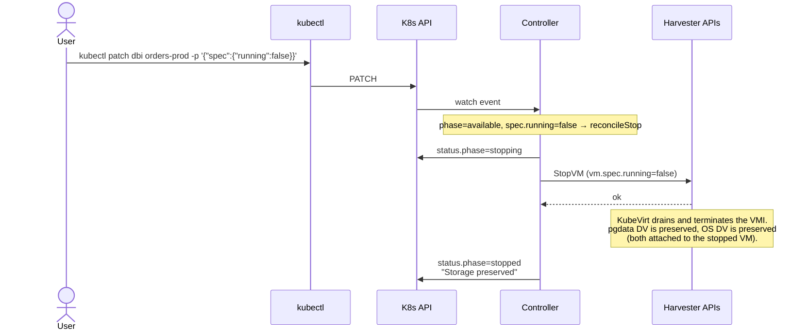
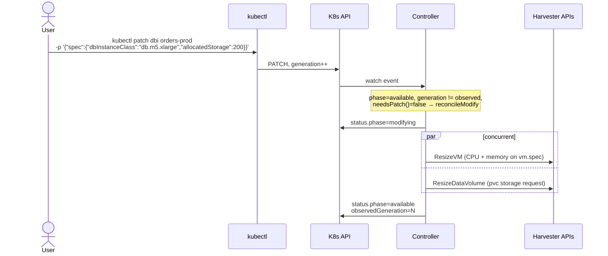
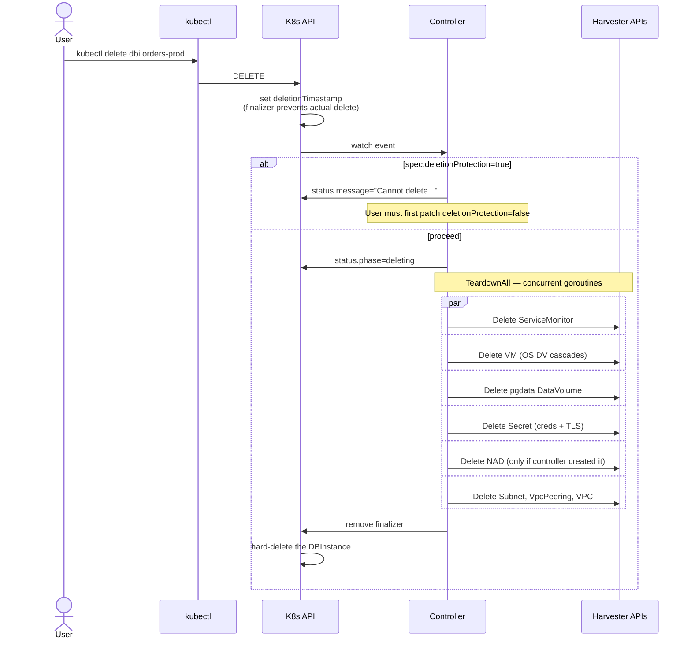

# DBaaS Interaction Diagrams

Sequence diagrams for each end-to-end use case the `dbaas-controller` supports. Use this as a reference when validating use cases or onboarding new team members. Diagrams use Mermaid (renders natively on GitHub).

## Actors

| Actor | Role |
|-------|------|
| **User** | A human or automation issuing API requests |
| **CLI** | `kubectl` or `curl` |
| **REST Gateway** | The HTTP listener inside the controller pod (`:8080`), translates RDS-style JSON ↔ CRD |
| **K8s API** | Kubernetes API server (Harvester runs this) |
| **Controller** | The `dbaas-controller` reconciler, in-cluster |
| **Harvester APIs** | KubeVirt, CDI, Kube-OVN, monitoring (called via dynamic client) |
| **VM** | The KubeVirt VirtualMachine for the database |
| **cloud-init** | First-boot bootstrap script inside the VM |
| **App** | An application pod connecting to the database |

## Use cases covered

- [1. Create a database](#1-create-a-database)
- [2. Query database info](#2-query-database-info)
- [3. Patch (OS image / minor version)](#3-patch-os-image--minor-version)
- [4. Start a stopped database](#4-start-a-stopped-database)
- [5. Stop a running database](#5-stop-a-running-database)
- [6. Modify (resize class / storage)](#6-modify-resize-class--storage)
- [7. Delete a database](#7-delete-a-database)
- [8. Application connects to the database](#8-application-connects-to-the-database)

---

## 1. Create a database

A user submits a `DBInstance` (either via the RDS-style REST API or `kubectl apply`). The controller walks the phase machine, talking to Harvester APIs at each step. PostgreSQL bootstraps inside the VM via cloud-init.



**Validation points**
- The OS DV is in `vm.spec.dataVolumeTemplates` → owned by the VM, garbage-collected when the VM is deleted.
- The pgdata DV is created standalone (separate `CreateDataVolume`) → survives VM deletion.
- The `Secret pg-{id}-credentials` holds `userdata` referenced by the VM (no plaintext cloud-init in the VM CR).
- The CA in `status.caCertPem` is per-instance — every DBInstance has its own self-signed CA.

---

## 2. Query database info

Read-only path. The REST gateway just reads the CRD and reformats; `kubectl` reads it directly.



**Validation points**
- The endpoint IP comes from the VMI's `vpc-net` interface (preferred), falling back to the first interface IP. Re-checked on every reconcile in `phaseAvailable`.
- The REST gateway has no caching — every GET is a live API server read.

---

## 3. Patch (OS image / minor version)

Triggered by `spec.osImage` changing on an `available` instance. The controller runs the immutable-rebuild state machine: stop → delete VM (OS DV cascades) → recreate VM on new image → cloud-init reattaches to existing encrypted pgdata.

```mermaid
sequenceDiagram
    actor User
    participant CLI as kubectl
    participant API as K8s API
    participant CTL as Controller
    participant H as Harvester APIs
    participant VM as PostgreSQL VM
    participant CI as cloud-init

    User->>CLI: kubectl patch dbi orders-prod<br/>-p '{"spec":{"osImage":"ubuntu-...-20260501.img"}}'
    CLI->>API: PATCH, generation++
    API->>CTL: watch event

    Note over CTL: phase=available, generation != observed,<br/>needsPatch() = true
    CTL->>API: phase=patching, provisioningPhase=PatchPending<br/>status.previousOSImage, patchState.targetOSImage

    Note over CTL,H: PatchPending — pre-flight validation
    CTL->>H: ResolveVMImage(target)
    H-->>CTL: ns, name, storageClass
    CTL->>API: provisioningPhase=PatchSnapshotting

    Note over CTL: PatchSnapshotting (placeholder — DBSnapshot controller TBD)
    CTL->>API: patchState.snapshotName, provisioningPhase=PatchStopping

    Note over CTL,VM: PatchStopping
    CTL->>H: StopVM (spec.running=false)
    loop until VMI gone
        CTL->>H: VMIGone?
        H-->>CTL: false / true
    end
    CTL->>API: provisioningPhase=PatchOSReplaced

    Note over CTL,H: PatchOSReplaced — destructive step
    CTL->>H: VMResourceGone?
    H-->>CTL: false
    CTL->>H: DeletePostgresVM
    Note over H: OS DV cascades via owner ref;<br/>pgdata DV (standalone) survives
    CTL->>H: VMResourceGone? (next reconcile tick)
    H-->>CTL: true
    CTL->>H: RecreatePostgresVMForPatch<br/>(new osImage, same Secret, reattach pgdata DV)
    H-->>CTL: VM created (running=true)
    CTL->>API: provisioningPhase=PatchStarting

    Note over VM,CI: VM boots on new image
    VM->>CI: cloud-init runs (fresh OS, same userdata)
    CI->>CI: cryptsetup isLuks /dev/vdb → already LUKS,<br/>skip luksFormat
    CI->>VM: luksOpen, mount /mnt/pgdata
    CI->>CI: PG_VERSION exists → FIRST_BOOT=0,<br/>skip data seed
    CI->>VM: set data_directory, SSL, pg_hba
    CI->>VM: systemctl start postgresql
    Note over CI: skip CREATE ROLE / CREATE DATABASE

    Note over CTL: PatchStarting → PatchVerifying
    CTL->>H: VMResourceGone?
    H-->>CTL: false (VM is back)
    CTL->>API: provisioningPhase=PatchVerifying
    loop until VMI Ready
        CTL->>H: GetVMIReadiness
        H-->>CTL: Pending / Running / Ready
    end

    CTL->>API: phase=available<br/>currentOSImage=target, lastPatchTime<br/>patchState=nil, endpoint refreshed
```

**Validation points**
- `status.patchState` persists across controller restarts. After a crash, `dispatchPatch` reads `status.provisioningPhase` to resume.
- The `Secret` is **not** regenerated — credentials, LUKS key, and TLS bundle survive the patch. Apps don't need new connection strings.
- `cryptsetup isLuks` is the gate that distinguishes first boot from re-patched boot. If this gate ever wrongly returns false, the format step would destroy pgdata. Worth a code review focus.
- TLA+ model in `proposals/tla/DBInstance.tla` exhaustively checks pgdata survival across all patch/stop/start/crash interleavings.

---

## 4. Start a stopped database

```mermaid
sequenceDiagram
    actor User
    participant CLI as kubectl
    participant API as K8s API
    participant CTL as Controller
    participant H as Harvester APIs

    User->>CLI: kubectl patch dbi orders-prod -p '{"spec":{"running":true}}'
    CLI->>API: PATCH
    API->>CTL: watch event
    Note over CTL: phase=stopped, spec.running=true → reconcileStart
    CTL->>API: status.phase=starting
    CTL->>H: StartVM (vm.spec.running=true)
    H-->>CTL: ok
    Note over H: KubeVirt starts a new VMI;<br/>cloud-init does NOT re-run<br/>(same OS disk, same instance-id)
    CTL->>API: status.phase=available<br/>observedGeneration=N
```

**Validation points**
- A start does **not** re-run cloud-init — the OS disk is unchanged and cloud-init's instance-id check skips it.
- The pgdata mount is re-opened by the systemd unit chain (`/etc/crypttab` + `/etc/fstab`), or — in the current design — by the bootstrap script on first boot of a fresh OS. ⚠️ **Open question to validate:** does the current cloud-init persist a crypttab/fstab entry so that a plain restart (no OS rebuild) re-opens the LUKS volume on boot? If not, the start path will fail to mount pgdata. (Patch path is unaffected because cloud-init re-runs there.)

---

## 5. Stop a running database



**Validation points**
- Compute is freed (no VMI = no node resources), storage is preserved. Billing implication: pgdata DV still uses Longhorn replicas.
- A stop while a patch is in flight is **not** modeled — the patch state machine doesn't honour `spec.running` until it transitions back to `available`. Validate whether this is the intended UX.

---

## 6. Modify (resize class / storage)

Triggered by `spec.dbInstanceClass` or `spec.allocatedStorage` changing. Live operation — no downtime expected.



**Validation points**
- KubeVirt CPU/memory changes typically require a VM restart to take effect; the current code just updates `spec` and doesn't restart. Validate whether RAM/CPU resize is actually applied online.
- DataVolume resize relies on Longhorn / underlying CSI supporting expansion. The pgdata filesystem inside the VM **also** needs to be grown (`resize2fs`) — this is not currently driven by the controller. Validate whether the team wants to add a phase that triggers an in-guest resize.

---

## 7. Delete a database



**Validation points**
- The tenant namespace is **never** deleted — it's owned by the cluster operator (created during onboarding via `make tenant-onboard`).
- NAD ownership: in VPC mode (`spec.networkRef` empty) the controller owns and deletes the NAD; in direct-NAD mode it does not delete the NAD because it didn't create it.
- All Harvester deletions are best-effort (errors ignored). Validate whether the team wants a retry/fail-loud policy if (say) the VPC delete fails because Kube-OVN still has references.

---

## 8. Application connects to the database

```mermaid
sequenceDiagram
    actor App as Application Pod
    participant API as K8s API
    participant Net as Kube-OVN VPC<br/>(routing + peering)
    participant VM as PostgreSQL VM<br/>10.x.x.x:5432

    Note over App: App needs DB endpoint + CA cert
    alt discovered via DBInstance
        App->>API: GET dbi orders-prod
        API-->>App: status.endpoint.jdbcUrl, status.caCertPem
    else configured statically
        Note over App: jdbcUrl in app config; CA mounted as Secret
    end

    Note over App,VM: TLS handshake (sslmode=verify-ca)
    App->>Net: TCP SYN → 10.x.x.x:5432
    alt same VPC
        Net->>VM: direct route
    else cross-VPC
        Net->>Net: VpcPeering routes
        Net->>VM: forwarded
    else cross-VLAN
        Net->>Net: subnet.allowSubnets + static route
        Net->>VM: forwarded
    end
    VM-->>App: TLS ServerHello (cert signed by per-instance CA)
    App->>App: verify cert chain against status.caCertPem
    App->>VM: TLS Finished

    Note over App,VM: PostgreSQL startup
    App->>VM: StartupMessage + scram-sha-256 auth
    Note over VM: pg_hba rejects non-SSL (hostssl-only)
    VM-->>App: AuthenticationOk
    App->>VM: SQL queries...
```

**Validation points**
- `sslmode=verify-ca` is the minimum recommended; consider `verify-full` if the team wants hostname checks (would require an SAN with the VM IP in the server cert, which the current TLS generator may or may not include).
- The per-instance CA means every DBInstance has a unique trust root. Apps need to fetch the CA each time a database is created — no global trust store.
- Cross-VPC reachability is opt-in via `spec.vpcPeering`. Default is reachable only from `dbSubnetGroupName` consumer VLAN.

---

## Out of scope (not yet implemented)

These flows are referenced by the type definitions but have no working controller:

- **DBSnapshot** create / restore — type exists, no reconciler.
- **Read replica** creation — `status.readReplicas` is a stub.
- **Failover / Multi-AZ** — `spec.multiAZ` is a stub.
- **Major version upgrade** (e.g. 14 → 15) — needs `pg_upgrade` flow, not the patch state machine.

If/when these land, this document should be extended with their interaction diagrams.
